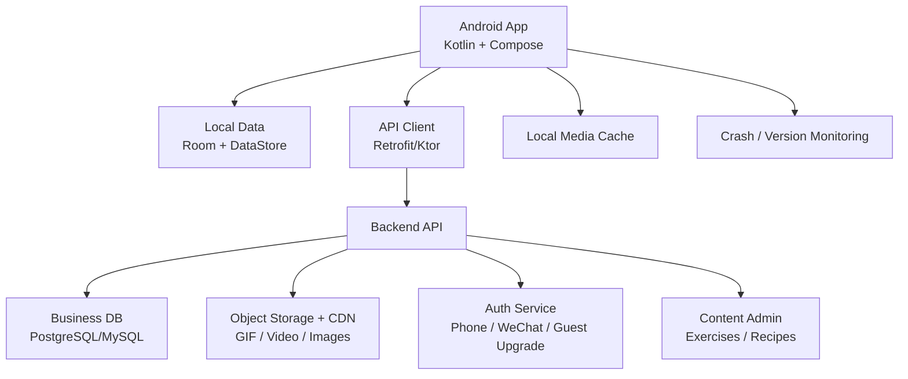
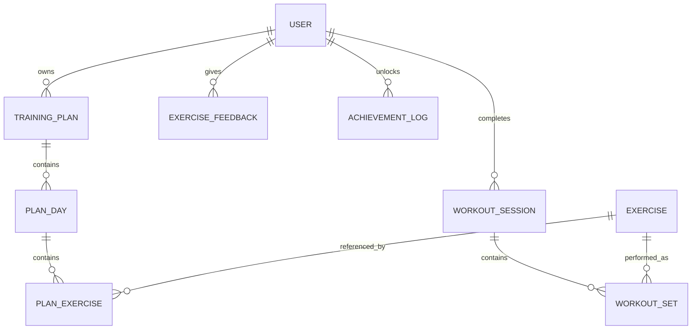
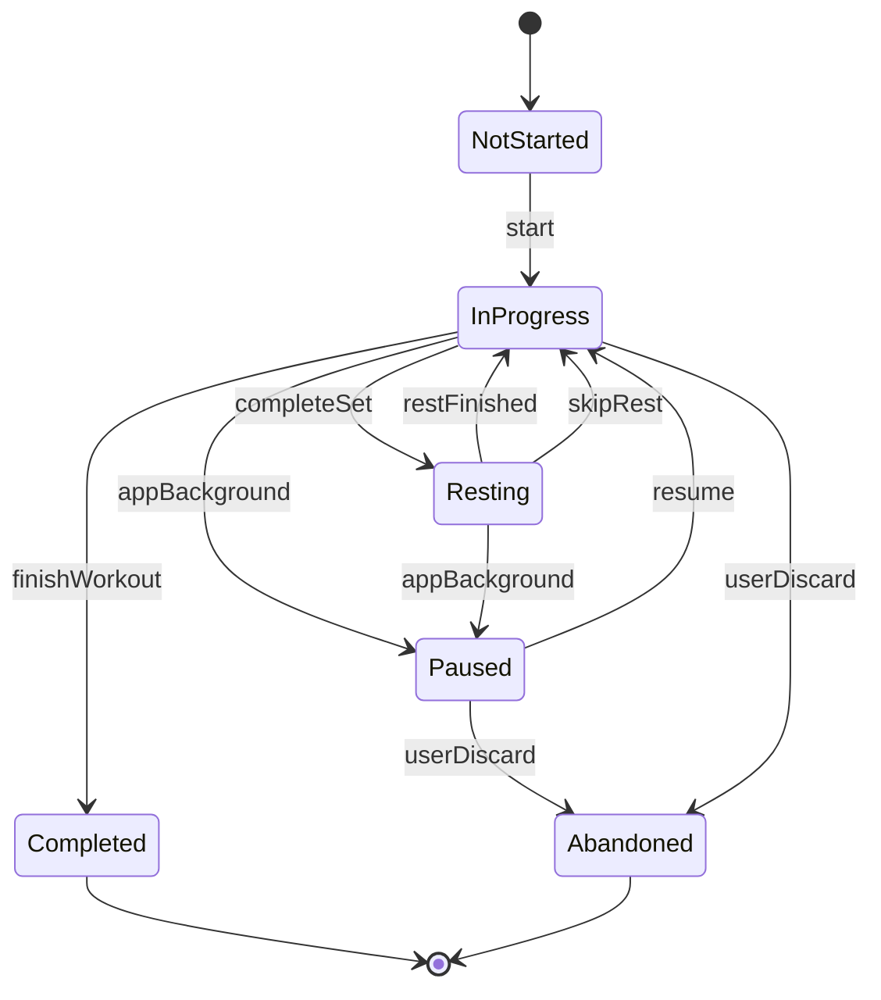

# AIFitnessPro Android App Product Plan

> Version: 0.1
> Date: 2026-05-18
> Target: Domestic Android app stores in mainland China
> Recommended stack: Kotlin + Jetpack Compose native Android app

## 1. Product Goal

AIFitnessPro Android is a native fitness training app for the domestic Android market. It should evolve the current WeChat mini program into a product-grade app centered on adaptive strength training, workout companionship, exercise education, and lightweight nutrition guidance.

The first Android release should prioritize a stable training loop:

1. Privacy consent.
2. Login or guest mode.
3. User onboarding profile.
4. Four-week training plan generation.
5. Today workout on the home screen.
6. Native workout session with set, rep, weight, rest timer, and feedback.
7. Workout summary, streak, achievements, and adaptive adjustments.
8. Exercise library with trustworthy text and media.

The first release should not include paid membership, social community, AI diagnosis, posture recognition, wearable integration, or real-time LLM coaching.

## 2. Recommended Product Positioning

The Android app should be designed as a training task product, not a port of mini program pages.

Primary positioning:

- Adaptive strength training plan.
- Low-friction workout recording.
- Exercise instruction with media.
- Companion-style training encouragement.
- Practical nutrition targets and meal suggestions.

Compliance positioning:

- The app provides training assistance and general fitness reference only.
- It must not claim medical, therapeutic, rehabilitation, or guaranteed weight-loss effects.
- Users with injuries, chronic disease, pregnancy, or other special conditions should consult professionals before training.

## 3. Target Release Channels

Initial domestic Android channels:

1. Huawei AppGallery.
2. Xiaomi App Store.
3. OPPO Software Store.
4. vivo App Store.
5. Tencent MyApp.

Later optional channels:

- Honor.
- Samsung China.
- 360 Mobile Assistant.
- Baidu Mobile Assistant.

Release preparation must include package name, signed release build, screenshots, icon, privacy policy URL, user agreement URL, app filing information, permission explanations, and a review test account if login is required.

## 4. Technology Direction

Recommended Android stack:

| Layer | Technology | Purpose |
|---|---|---|
| UI | Kotlin + Jetpack Compose | Native app screens and components |
| Architecture | MVVM with Repository | Maintainable state and data flow |
| Navigation | Navigation Compose | Home, training, exercise library, profile |
| Local database | Room | Plans, workout sessions, sets, cached exercises |
| Local settings | DataStore | Tokens, consent, settings |
| Network | Retrofit or Ktor Client | Backend API calls |
| Image/GIF | Coil | Images, thumbnails, GIF loading |
| Video | Media3 / ExoPlayer | Exercise videos |
| Background work | WorkManager | Sync queue, media pre-cache |
| Notification | Android Notification | Workout reminders and rest completion |
| Crash monitoring | Sentry, Bugly, or equivalent | Production crash diagnosis after consent |

Recommended backend stack:

| Component | Recommendation |
|---|---|
| API service | Node.js + NestJS |
| Database | PostgreSQL or MySQL |
| Object storage | Domestic cloud object storage |
| CDN | Domestic CDN for exercise media |
| Admin | Lightweight content admin for exercises and recipes |

The existing WeChat cloud functions should not be the long-term backend for the Android app.

## 5. High-Level Architecture

Core technical principle:

- Workout data is local-first.
- Network sync should never block a workout.
- A completed workout is terminal and must not be overwritten by app background or page destroy events.

## 6. Android Product Modules

Bottom navigation should use four tabs:

1. Home.
2. Training.
3. Exercise Library.
4. Profile.

Nutrition should not be a bottom tab in the first release. It should appear as a home summary and profile entry until the diet feature becomes strong enough to stand alone.

| Module | Release Scope | Notes |
|---|---|---|
| Auth and compliance | Required | Privacy consent, login, guest mode, account deletion |
| Onboarding | Required | 9-step user profile flow |
| Home | Required | Today workout center |
| Training plan | Required | Four-week PPL plan, 3/4/5 days per week |
| Workout session | Required | Set, rep, weight, rest, pause, resume, feedback |
| Exercise library | Required | 70+ exercises, core media, filtering |
| Nutrition | MVP lightweight | Macro target and meal suggestions |
| Profile and settings | Required | Profile, stats, privacy, permissions, deletion |
| Achievements | MVP lightweight | Trigger after workout completion |

## 7. Current Mini Program Migration Strategy

Retain business logic, rewrite Android experience:

| Mini Program Feature | Android Treatment |
|---|---|
| 9-step onboarding | Keep fields, rebuild native flow |
| Goal, experience, equipment | Keep |
| PPL plan generation | Keep for MVP |
| Four-week periodization | Keep |
| RPE and standard feedback | Keep |
| Minimal mode | Keep |
| Persona templates | Keep |
| Nutrition macro calculation | Keep |
| Recipe JSON | Clean and migrate to backend |
| Achievements | Keep but auto-trigger |

Must rewrite:

| Mini Program Feature | Android Replacement |
|---|---|
| Home page | Today workout center |
| Training page | Native workout state machine |
| Breakpoint recovery | Room + backend sync |
| Custom tab bar | Android Bottom Navigation |
| Cloud functions | Backend API |
| WeChat cloud DB | App backend DB |
| Local storage | Room/DataStore |
| Exercise detail | Media-first native page |
| Profile page | Profile + Settings + Compliance |

Do not migrate:

- WeChat-specific sharing flow.
- WeChat cloud environment config.
- Mini program lifecycle logic.
- Mini program sitemap.
- Old debug, test, and static pages.
- `_openid` as primary identity.

## 8. Known Current Gaps

These issues should not be carried into the Android app:

| Gap | Current State | Android Requirement |
|---|---|---|
| Exercise count | Around 18 exercises in bundled data | At least 70 published exercises |
| GIF/video | 0 GIF/video items | Core 30 exercises require GIF or short video |
| Identity fields | Mixed `_openid` and `userId` | Unified `user_id` |
| Workout status | Completed may be overwritten as abandoned | Completed is terminal |
| Training file size | `training.js` is too large | Split state, timer, feedback, resume, summary |
| Weight recording | Often missing | Weight is a first-class field per set |
| Achievement trigger | Manual refresh path exists | Auto-check after workout completion |
| Documentation drift | Status doc does not match data | Android status docs must be factual |

## 9. Compliance Requirements

Compliance is P0 for domestic Android stores.

Required items:

1. App filing preparation.
2. HTTPS privacy policy URL.
3. HTTPS user agreement URL.
4. First-launch privacy consent dialog.
5. No default consent checkbox.
6. Non-essential SDKs initialized only after consent.
7. Permission request only at point of use.
8. Account deletion in app.
9. Personal information collection list.
10. Third-party SDK list.
11. Fitness and health disclaimer.
12. Contact information in privacy policy.
13. User profile edit and authorization withdrawal paths.

Recommended first-release permission policy:

| Permission | First Release Decision |
|---|---|
| Network | Required |
| Notification | Optional, request only when enabling reminders |
| Photo/storage | Optional, request only when saving poster |
| Camera | Do not request |
| Location | Do not request |
| Contacts | Do not request |
| Microphone | Do not request |
| Bluetooth | Do not request |

## 10. Data Model Direction

The Android backend should use structured relational data instead of large nested document blobs.

Core entities:

Main backend tables:

- `users`
- `user_profiles`
- `user_settings`
- `consent_logs`
- `training_plans`
- `plan_days`
- `plan_exercises`
- `exercises`
- `exercise_media`
- `workout_sessions`
- `workout_sets`
- `exercise_feedback`
- `exercise_adjustments`
- `recipes`
- `daily_meal_plans`
- `achievements`
- `achievement_logs`

Local Room should store only what the app needs offline:

- Current user profile.
- Current training plan.
- Plan days and plan exercises.
- Exercise cache.
- Active workout session.
- Workout sets.
- Sync queue.

Mini program field replacement:

| Mini Program | Android / Backend |
|---|---|
| `_openid` | `user_id` |
| `current_plan_id` | active plan query or `active_plan_id` |
| `weeklyPlan[]` | `training_plans + plan_days + plan_exercises` |
| `exercise_adjustments` object | `exercise_adjustments` table |
| `feedback` collection | `exercise_feedback + workout_sessions` |
| `training_logs` collection | `workout_sessions + workout_sets` |
| `recipes.json` | `recipes` table |
| `exercises.json` | `exercises + exercise_media` tables |

## 11. Workout State Machine

The Android workout session must be driven by a clear state machine:

Rules:

1. `Completed` is terminal.
2. Backgrounding creates `Paused`, not `Abandoned`.
3. Only explicit user discard creates `Abandoned`.
4. Every completed set is written locally immediately.
5. Sync failure does not block training.

## 12. Page and Interaction Plan

### Home

Goal: users know what to do today within three seconds.

Home should show:

- Greeting and streak.
- Today workout card.
- Start or continue workout button.
- Next workout preview.
- Nutrition summary.
- Companion message.
- Generate plan prompt if no active plan exists.

### Training

Workout states:

- Pre-start summary.
- Warmup prompt.
- Current exercise.
- Active set input.
- Rest timer.
- Exercise feedback.
- Overall RPE.
- Workout summary.

Core workout controls:

- Current exercise media.
- Set progress.
- Weight input.
- Rep input.
- Complete set.
- Skip rest.
- Skip exercise.
- Exercise detail.
- Discard workout with confirmation.

### Exercise Library

Exercise library should support:

- Search.
- Muscle filter.
- Equipment filter.
- Difficulty filter.
- Media-first exercise detail.
- Common mistakes.
- Safety notes.
- Alternatives.

### Training Plan

Training tab should show:

- Current four-week plan.
- Current week.
- Day cards.
- Completed state.
- Rest days.
- Start selected day.
- Regenerate plan with confirmation.

### Nutrition

First release:

- Macro target.
- Training/rest day switch.
- Meal recommendations.
- Recipe detail.
- Saved selection.

Not first release:

- Food weighing.
- Barcode scanning.
- Photo recognition.

### Profile

Profile must include:

- Personal profile.
- Training stats.
- Feedback mode.
- Persona style.
- Reminder settings.
- Privacy policy.
- User agreement.
- Permission management.
- Account deletion.
- About and disclaimer.

## 13. Content Library Plan

First release exercise target:

- At least 70 exercises.
- Core 30 exercises with GIF or short video.
- All exercises with instructions, common mistakes, safety notes, muscles, equipment, and difficulty.
- All media with source and license records.
- Media failure fallback.
- Plan generation only uses published exercises.

Suggested distribution:

| Category | Count |
|---|---:|
| Chest | 10 |
| Back | 12 |
| Shoulders | 10 |
| Legs and glutes | 14 |
| Arms | 10 |
| Core | 8 |
| Full-body/bodyweight | 6 |

Core media priority should include squat, deadlift, bench press, incline press, dumbbell press, pull-up, lat pulldown, barbell row, seated row, shoulder press, lateral raise, face pull, leg press, Romanian deadlift, lunge, hip bridge, barbell curl, hammer curl, triceps pushdown, dip, plank, crunch, hanging leg raise, push-up, Bulgarian split squat, dumbbell row, dumbbell fly, reverse fly, calf raise, and dead bug.

Media sourcing policy:

1. Prefer self-produced or licensed media.
2. Store license/source metadata.
3. Avoid unknown online GIF scraping.
4. Do not rely on AI-generated action media for instructional accuracy.

Recipe content:

- Existing 150 recipes can seed the first release.
- Clean fields for calories, protein, carbs, fat, ingredients, meal type, suitable goals, prep time, difficulty, allergens, and status.

## 14. MVP Milestones

### M0: Product and Compliance Finalization

Estimated time: 3-5 days.

Deliverables:

- Android product spec.
- Information architecture.
- Compliance checklist.
- Technical architecture.
- Data model.
- 70-exercise content list.

Acceptance:

- Kotlin + Compose confirmed.
- Domestic Android stores confirmed.
- MVP excludes AI, membership, and community.
- Compliance requirements documented.

### M1: Android App Skeleton

Estimated time: 1 week.

Deliverables:

- Android project.
- Compose theme.
- Bottom navigation.
- Room/DataStore.
- API client.
- First-launch consent.
- Basic settings page.

Acceptance:

- App installs and launches.
- Privacy consent appears.
- Four tabs switch.
- Local storage works.
- Mock API request works.

### M2: Auth, Onboarding, and Plan

Estimated time: 1-2 weeks.

Deliverables:

- Login or guest mode.
- User profile onboarding.
- User API.
- Plan generation.
- Local plan cache.
- Home today workout.

Acceptance:

- User completes onboarding.
- App generates a 28-day plan.
- Home shows today workout.
- Cached plan works offline.

### M3: Workout Loop

Estimated time: 2 weeks.

Deliverables:

- Workout state machine.
- Workout page.
- Set-level records.
- Resume support.
- Feedback modes.
- Workout summary.
- Achievement trigger.
- Sync queue.

Acceptance:

- User completes a workout.
- Sets persist locally.
- App can restore an interrupted workout.
- Completed workout is not overwritten.
- Total volume is not zero when weights are entered.
- Feedback affects future plan.

### M4: Exercise Library and Nutrition

Estimated time: 2-3 weeks.

Deliverables:

- 70 exercises.
- Core 30 media items.
- Exercise detail.
- Filters.
- Media cache.
- Nutrition targets.
- Cleaned recipe content.

Acceptance:

- 70+ published exercises.
- Core 30 have media.
- Exercise detail has no empty key fields.
- Nutrition plan works for training/rest days.

### M5: Compliance, Testing, Release Preparation

Estimated time: 1-2 weeks.

Deliverables:

- Privacy policy and user agreement URLs.
- App filing materials.
- Real account deletion.
- Permission prompts.
- SDK list.
- Icon and screenshots.
- Test account.
- Release signed build.
- Device test report.

Acceptance:

- Consent flow passes review.
- Account deletion works.
- Permissions are requested at point of use.
- Main domestic devices pass smoke tests.
- App is ready to submit to at least one store.

## 15. Launch Readiness Checklist

Do not submit if any red-line issue exists:

1. Non-essential SDK initializes before consent.
2. Unrelated permissions are requested.
3. Account deletion is missing.
4. Privacy policy URL is broken.
5. Exercise detail pages have major empty content.
6. Workout completion data can be lost.
7. Interrupted workout cannot be resumed.
8. App copy claims guaranteed weight loss, treatment, or rehabilitation.
9. Backend API is not HTTPS.
10. Release signature, package name, or versioning is unstable.

Minimum release standard:

- Complete compliance flow.
- Onboarding works.
- Plan generation works.
- Workout loop works.
- Workout record persists.
- Exercise library has at least 70 exercises.
- Core 30 exercises have media.
- Home, training, exercise library, and profile tabs are stable.
- Account deletion works.
- Main domestic Android devices pass testing.

## 16. Next Planning Documents

This product plan should be followed by:

1. Android MVP implementation plan.
2. Backend API specification.
3. Database schema specification.
4. Exercise content production tracker.
5. Domestic app store submission checklist.

