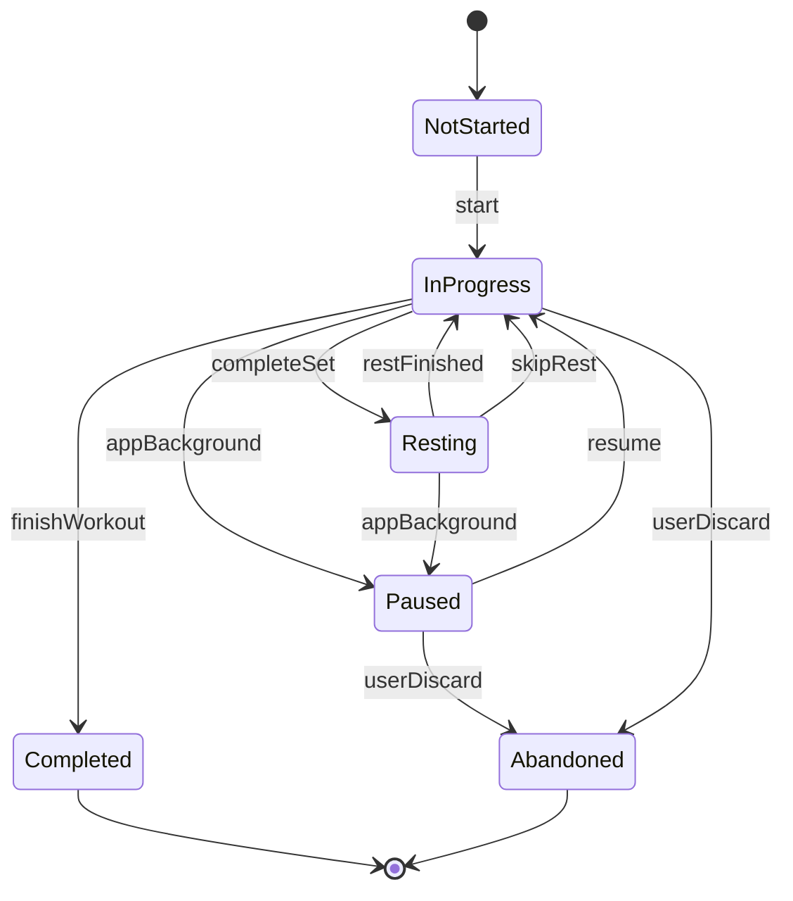

# AIFitnessPro Android App Product Design

> Source plan: `docs/android-app-product-plan.md`
> Date: 2026-05-18
> Target platform: Domestic Android app stores in mainland China
> Recommended stack: Kotlin + Jetpack Compose native Android app

## Decision

AIFitnessPro should become a native Android app for domestic Android markets, not a WebView wrapper or direct mini program port.

The product should keep the existing mini program's valuable business assets:

- User onboarding fields.
- PPL and four-week periodized plan generation.
- RPE and standard feedback.
- Minimal workout mode.
- Persona-based companion messages.
- Nutrition macro calculation.
- Recipe seed data.
- Basic achievements.

The Android app must rebuild:

- App navigation and screens.
- Account identity.
- Local-first workout data.
- Backend API.
- Relational database model.
- Exercise content and media library.
- Domestic compliance flow.

## First Release Scope

The first Android release should deliver a stable, compliant workout loop:

1. First-launch privacy consent.
2. Login or guest mode.
3. User onboarding profile.
4. Four-week training plan generation.
5. Today workout home screen.
6. Native workout session with set, rep, weight, rest timer, pause/resume, and feedback.
7. Workout summary with streak and achievements.
8. Exercise library with at least 70 exercises and media for the core 30.
9. Lightweight nutrition target and meal suggestions.
10. Profile/settings with privacy policy, user agreement, permissions, and account deletion.

The first release excludes:

- Paid membership.
- Social community.
- AI diagnosis or medical advice.
- Posture recognition.
- Wearable integration.
- Real-time LLM coaching.

## Architecture

Android:

- Kotlin + Jetpack Compose.
- MVVM with Repository.
- Navigation Compose.
- Room for local data.
- DataStore for settings and consent.
- Retrofit or Ktor Client for API calls.
- Coil for image/GIF loading.
- Media3 / ExoPlayer for exercise videos.
- WorkManager for sync and media pre-cache.

Backend:

- Node.js + NestJS.
- PostgreSQL or MySQL.
- Object storage + CDN for exercise media.
- Lightweight content admin for exercises and recipes.

Data principle:

- Workout sessions are local-first.
- Network sync must never block training.
- A completed workout is terminal and cannot be overwritten by lifecycle events.

## Major Data Model Direction

The Android backend should use structured tables:

- `users`
- `user_profiles`
- `user_settings`
- `consent_logs`
- `training_plans`
- `plan_days`
- `plan_exercises`
- `exercises`
- `exercise_media`
- `workout_sessions`
- `workout_sets`
- `exercise_feedback`
- `exercise_adjustments`
- `recipes`
- `daily_meal_plans`
- `achievements`
- `achievement_logs`

The mini program's `_openid` identity must be replaced by a unified `user_id`.

The mini program's nested `weeklyPlan[]` should become `training_plans + plan_days + plan_exercises`.

Workout history should become `workout_sessions + workout_sets`, not only one feedback document per workout.

## Workout State Machine

The Android app must implement a clear workout state machine:

Rules:

1. `Completed` is terminal.
2. App backgrounding creates `Paused`, not `Abandoned`.
3. Only explicit user discard creates `Abandoned`.
4. Every completed set is written locally immediately.
5. Sync failure does not block training.

## Compliance Requirements

Domestic Android store compliance is P0:

- App filing preparation.
- HTTPS privacy policy URL.
- HTTPS user agreement URL.
- First-launch privacy consent dialog.
- No default consent checkbox.
- Non-essential SDKs initialized only after consent.
- Permission request only at point of use.
- Account deletion in app.
- Personal information collection list.
- Third-party SDK list.
- Fitness and health disclaimer.
- Contact information in privacy policy.

First-release permissions should be minimal:

- Required: network.
- Optional: notification, requested only when enabling reminders.
- Optional: photo/storage, requested only when saving a poster.
- Do not request camera, location, contacts, microphone, or Bluetooth in the first release.

## Content Requirements

Exercise library first-release target:

- At least 70 published exercises.
- Core 30 exercises have GIF or short video.
- All exercises include instructions, common mistakes, safety notes, muscles, equipment, and difficulty.
- All media has source and license metadata.
- Plan generation only uses published exercises.

Recipe content:

- Existing 150 recipes can seed the first release.
- Clean fields for calories, protein, carbs, fat, ingredients, meal type, suitable goals, prep time, difficulty, allergens, and status.

## Scope Decomposition

This design is too large for one implementation plan. It should be split into these implementation plans:

1. Android foundation and compliance shell.
2. Backend API and database foundation.
3. Auth, onboarding, and training plan generation.
4. Native workout session loop.
5. Exercise library content and media.
6. Nutrition, achievements, and profile polish.
7. Domestic store submission and release hardening.

The first executable plan should be **Android foundation and compliance shell**, because every later feature depends on the app skeleton, consent state, navigation, and local storage.

## Success Criteria

The first Android release is ready for domestic market submission when:

1. Compliance flow is complete.
2. Onboarding works.
3. Plan generation works.
4. Workout loop works.
5. Workout records persist locally and sync.
6. Exercise library has at least 70 exercises.
7. Core 30 exercises have media.
8. Home, training, exercise library, and profile tabs are stable.
9. Account deletion works.
10. Main domestic Android devices pass testing.

